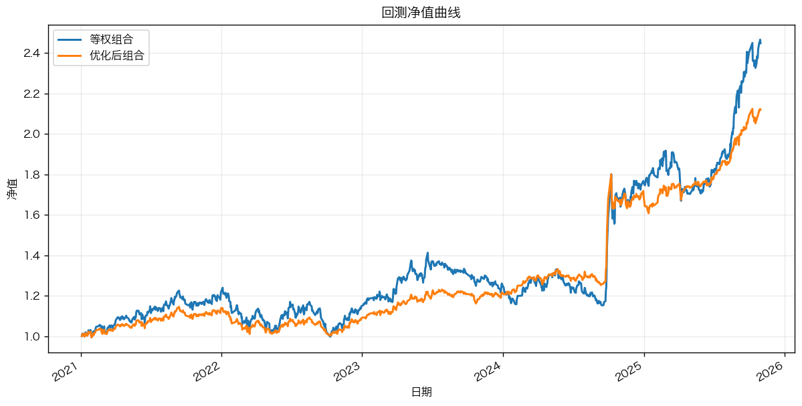
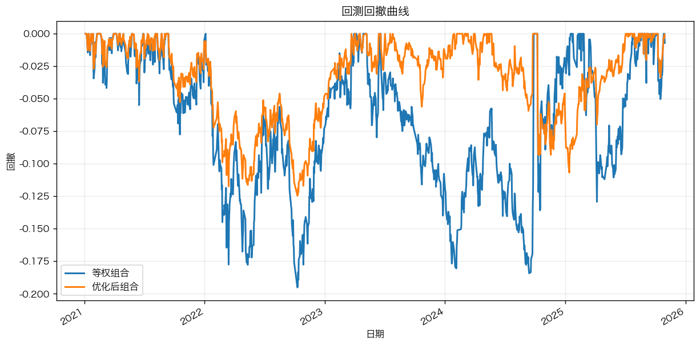

# SignalFive

SignalFive 是一个 ETF 组合策略开发项目，覆盖以下核心流程：因子设计和测试、因子合成、组合优化、宏观仓位调整、模型调参。

## 快速开始

```bash
conda env create -f environment.yml
conda activate signalfive_py311
pip install -e .
```

## 项目要求

这是一个 ETF 组合策略项目。核心任务是：在给定 28 只非债券 ETF 的前提下，基于量价与宏观数据做因子选股和组合优化，按周调仓，在 2021 年以后回测中获得更高风险调整收益（Sharpe）并控制回撤。

## 交易约束与项目落地

- 资产范围：仅 28 只非债券 ETF。
- 回测起点：`2021-01-04`。
- 调仓频率：周度（每周首个交易日）。
- 持仓约束：单资产权重不超过 `35%`，最小持仓数受约束。
- 成本设定：手续费万分之 `2.5`。
- 回测口径：风险收益指标统一基于收盘价计算。
- 框架要求：回测框架统一使用 `bt`。
- 规则红线：调仓期若使用调仓期后的数据/信息，判定为未来函数。
- 滑点口径：初赛回测可不考虑滑点。
- 前视控制：因子合成采用 `fwd shift + rolling`，调参与评估采用训练/测试切分。

以上约束已在当前代码流程中实现，并作为调参时的可行性与筛选条件。

## 任务拆解

### 任务一：因子构建与单因子测试

- 赛题要求：基于附件 2/3 构建因子，做单因子测试，至少包含 RankIC、IR。
- 当前完成：已实现多类截面因子与宏观因子；已输出 Rank IC 与 ICIR；有效因子筛选流程已跑通。

### 任务二：ETF 初选与等权组合

- 赛题要求：每周首个交易日按合成因子排序选前 N（`N>=3`）并等权回测。
- 当前完成：周度 TopN 选股与等权组合已实现，基础绩效指标可导出。

### 任务三：组合优化与对比分析

- 赛题要求：在任务二基础上加入优化模型，并与等权对比。
- 当前完成：已支持 `risk_parity / min_variance / cvar / hybrid_cvar_rp`，并可输出优化后与等权的净值和指标对比。

## 项目整体思路

1. 读取并对齐数据：量价、宏观、资产池。
2. 计算因子矩阵：得到日度 `date × sec` 的因子值。
3. 单因子检验：用 Rank IC 评估因子有效性并筛选。
4. 因子合成：按滚动 IC/ICIR 权重合成 `composite` 分数。
5. 选股：每个调仓日取 TopN 标的。
6. 组合优化：在选中标的中用 `risk_parity / cvar / hybrid_cvar_rp` 生成权重。
7. 宏观仓位调节：用 regime 信号缩放总仓位。
8. 回测评估：输出收益、波动、Sharpe、回撤、Calmar、尾部风险与结构指标。

## 主要结果（等权 vs 最终优化）

| 指标 | 等权策略 | 最终优化策略 | 变化 |
|---|---:|---:|---:|
| 年化夏普比率 | 0.9926 | 1.2700 | +0.2774 |
| 年化波动 | 0.2058 | 0.1329 | -35.4% |
| 最大回撤 | 0.1951 | 0.1246 | -36.1% |

结论：最终优化策略在提升 Sharpe 的同时，显著降低了波动与回撤。

### 净值曲线



### 回撤曲线



## 常用运行命令

```bash
# 主流程（因子 -> 选股 -> 优化 -> 回测）
python src/signalfive/pipelines/run_main.py

# WFO + Bayes 调参
python src/signalfive/pipelines/run_cvar_bayes.py --help

# 严格 OOS 流程
python src/signalfive/pipelines/run_strict_oos_stitch.py --help
```

也可以使用脚本：

```bash
# Windows
.\run_strict.bat

# Linux / macOS
bash ./run_strict.sh
```

安装为可执行命令后，也可以直接运行：

```bash
signalfive-main
signalfive-cvar-bayes --help
signalfive-strict-oos --help
```

## 目录结构

```text
SignalFive/
├── data/                      # 比赛原始数据 + 因子清单
├── docs/                      # 文档
├── src/
│   └── signalfive/            # 核心代码
├── scripts/                   # 可直接运行的批处理/脚本
├── pyproject.toml
├── requirements.txt
├── environment.yml
└── INSTALL.md
```

## 说明

- 运行输出默认写入 `outputs/`，日志写入 `logs/`。
- `.gitignore` 已默认忽略 `outputs/` 和 `logs/`，便于保持仓库干净。
- 项目根目录由 `src/signalfive/config/base.py` 自动推断，不依赖外部绝对路径。
